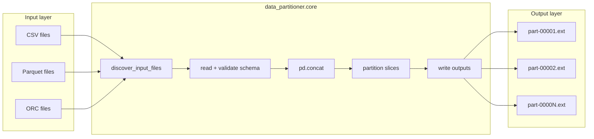

# Architecture

`data-partitioner` rebalances uneven tabular files (CSV, Parquet, ORC) into output partitions with roughly uniform row counts. Version **0.1.0** uses an in-memory pandas pipeline: read all inputs, concatenate, slice, write outputs.

## System context



## Module boundaries

| Module | Path | Responsibility |
|--------|------|----------------|
| Package entry | `src/data_partitioner/__init__.py` | Public exports: `rebalance`, `FileFormat`, `RebalanceResult`, `__version__` |
| Core | `src/data_partitioner/core.py` | Discovery, I/O, validation, partitioning, result model |
| CLI | `src/data_partitioner/cli.py` | `argparse` wrapper around `rebalance()` |

### Public API vs internal helpers

**Exported (stable):**

- `rebalance(...)` — main operation
- `FileFormat` — `csv`, `parquet`, `orc`
- `RebalanceResult` — summary dataclass with `as_dict()`

**Importable but not re-exported from package root:**

- `discover_input_files()` — file/directory discovery (used by `rebalance`, also testable directly)
- `build_parser()`, `main()` — CLI (`data-partitioner` console script)

**Private (`_` prefix):**

- `_validate_partitioning_args`, `_normalize_input_formats`, `_infer_format`, `_read_file`, `_write_file`

## Rebalance pipeline (V1)

1. **Validate sizing** — exactly one of `target_rows_per_file` or `num_output_files` (positive).
2. **Discover inputs** — single file or recursive directory via `rglob(glob_pattern)`; filter by extension/format.
3. **Read and validate** — load each file with pandas; require identical column names/order across files.
4. **Combine** — `pd.concat(..., ignore_index=True)`.
5. **Derive chunk size** — fixed `target_rows_per_file`, or `ceil(total_rows / num_output_files)` when driven by file count.
6. **Write partitions** — `{output_prefix}-{index:05d}.{format}` under `output_dir`.

Row order is preserved: concatenation order follows sorted discovered paths, then sequential slices.

## Format handling

| Extension | `FileFormat` | Read | Write |
|-----------|--------------|------|-------|
| `.csv` | `CSV` | `pd.read_csv` | `DataFrame.to_csv` |
| `.parquet` | `PARQUET` | `pd.read_parquet` | `DataFrame.to_parquet` |
| `.orc` | `ORC` | `pd.read_orc` (if available) | `DataFrame.to_orc` (if available); slices are `reset_index`’d before write because ORC requires a default index |

Default `input_formats`: all three. Default `output_format`: inferred from the first discovered input file.

Non-matching extensions during directory discovery are **skipped** (not errors).

## CLI mapping

| CLI flag | `rebalance()` argument |
|----------|------------------------|
| `input_path` (positional) | `input_path` |
| `output_dir` (positional) | `output_dir` |
| `--target-rows-per-file` | `target_rows_per_file` |
| `--num-output-files` | `num_output_files` |
| `--input-formats` | `input_formats` |
| `--output-format` | `output_format` |
| `--glob-pattern` | `glob_pattern` |
| `--output-prefix` | `output_prefix` |
| `--json` | prints `RebalanceResult.as_dict()` |

## Error model

| Condition | Exception |
|-----------|-----------|
| Both or neither sizing modes | `ValueError` |
| Non-positive sizing values | `ValueError` |
| Missing input path | `ValueError` |
| No matching files | `ValueError` |
| Zero total rows | `ValueError` |
| Column mismatch across inputs | `ValueError` |
| Unsupported extension | `ValueError` |
| Unknown format string | `ValueError` |
| Empty `input_formats` | `ValueError` |
| ORC unsupported in pandas build | `RuntimeError` |

## Known limitations (V1)

- **Memory**: entire dataset loaded into RAM (all input frames + combined frame + each output chunk).
- **Scale**: suitable for moderate datasets; not streaming or distributed.
- **Schema**: column **names and order** must match; dtypes are not explicitly validated.
- **Discovery**: `input_path` must be a file or directory (not object stores without a local mount).
- **Determinism**: output file order follows slice order; input file order is sorted paths from discovery.

## Planned evolution (not implemented)

Documented direction for future work:

- Chunked / streaming reads and writes
- Pluggable backends (object storage, Spark/Dask)
- Optional sort keys before partitioning
- Dtype-preserving writers and stricter schema contracts

When adding features, preserve the `rebalance()` result contract unless versioning explicitly breaks it.

## Repository layout

```
src/data_partitioner/     # library source
tests/                    # unit tests (fast)
tests/performance/        # timing, disk, memory benchmarks
docs/                     # architecture and agent-oriented docs
.github/workflows/        # CI (lint, unit coverage, performance)
```

See also: [testing.md](testing.md), [../AGENTS.md](../AGENTS.md).
